# CBT-Buddy

## Iteration 1

### Victor Wu

Created the project. Created folders and files for screens and components. Created firebase setup and helper files. Colro helper file. Added dependencies to package.json

Created tab navigation for each feature of app. Nested stack navigators within tab navigation.

Created login authentication through firebase.

Created sign up through firebase. Profile Screen with signout.

Use City of Vancouver Open Data to make 3rd party API call and put in a FlatList of Pressables that when clicked will give more information. (Will add more details and styling later.)

Created deep breathing relaxation countdown timer that has different time intervals for breathing in, holding your breath, and breathing out.

### Yiwei Tao

Complete initial screens of Journal. The initial screen in Journal tab is browsing all Journal entries.
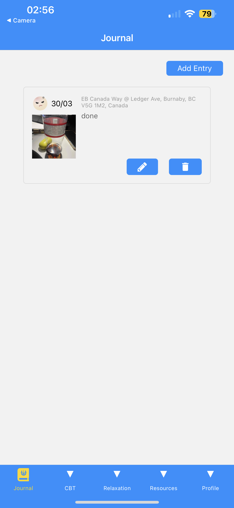

#### Mood Page
Automatically jump to the next entry after selecting the corresponding mood.

#### Detail Page
This page allows you to record your thoughts in text form.

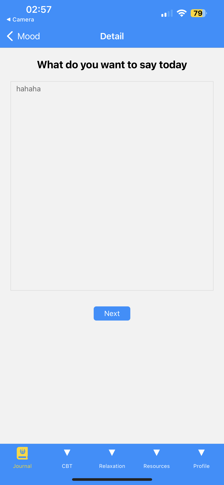

#### Photo and Location Page
Preliminary implementation of the selection of albums or photos, and open the map to manually select the location of the function.

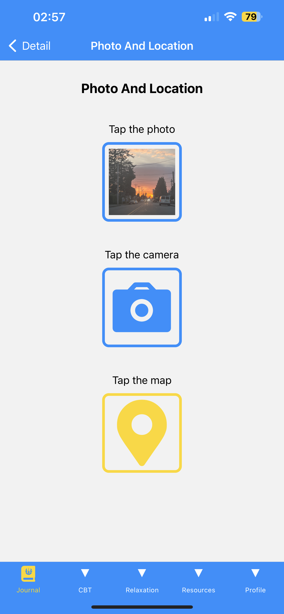

#### Map Page
Choose your own preferred geographic location.

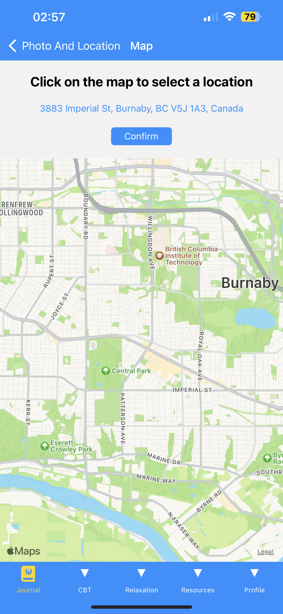

#### Journal Page
Automatically jump to the home page after adding a location.

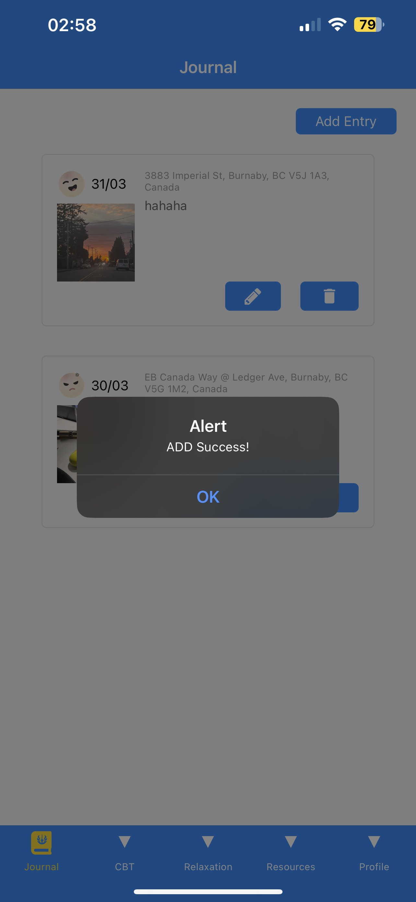

#### Edit Page
To implement the update function, click on the corresponding entry on this page to change the corresponding content.

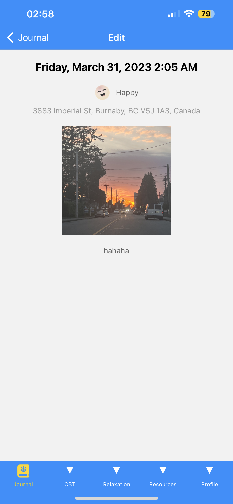

### Xilong Cai

Complete initial screens of CBT. The initial screen in CBT tab is browsing all CBT entries.
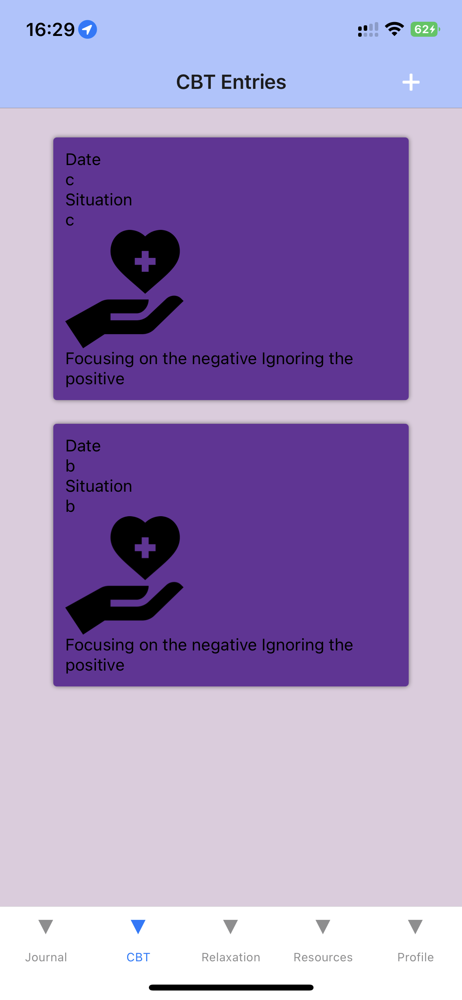

#### Add an entry

To add an entry, users could press the plus icon on the top right corner and fill the form. At first they will describe the situation.

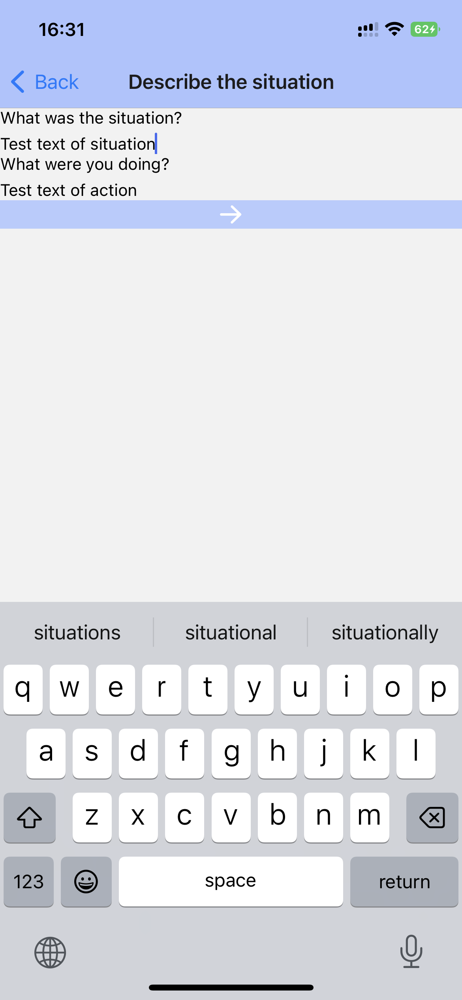 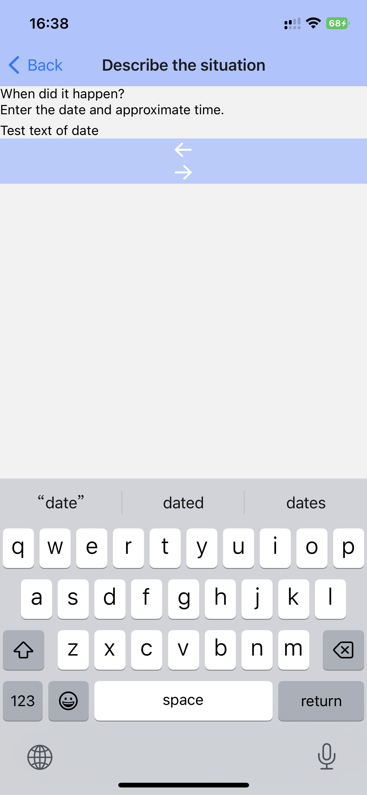 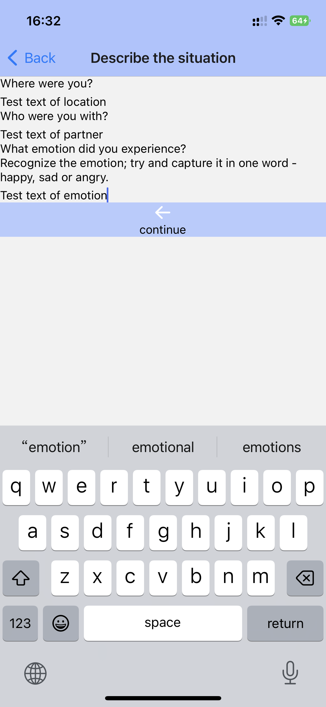

Then they will choose the cognitive distortions.(Right is when the distortion is chosen. There will be many distortions although now there is only one)

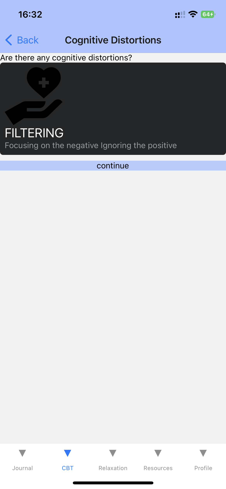 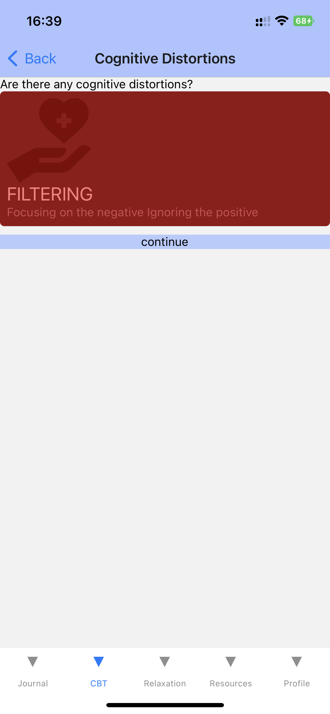

Finally users will write how can reframe the thought.

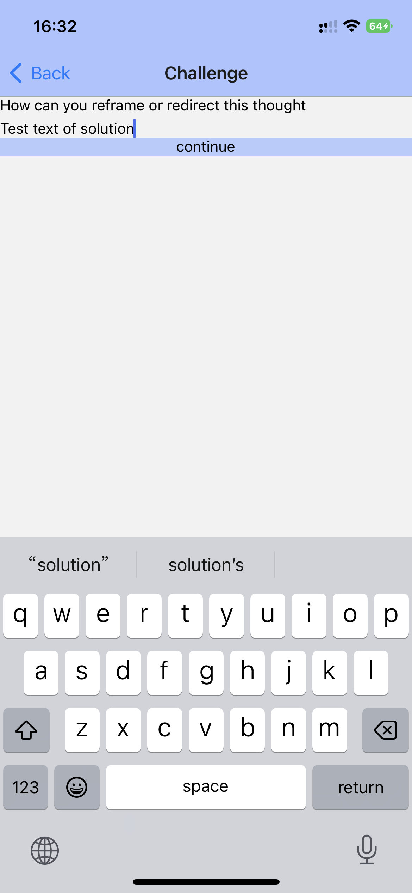
Now all information has been filled, and users could review it
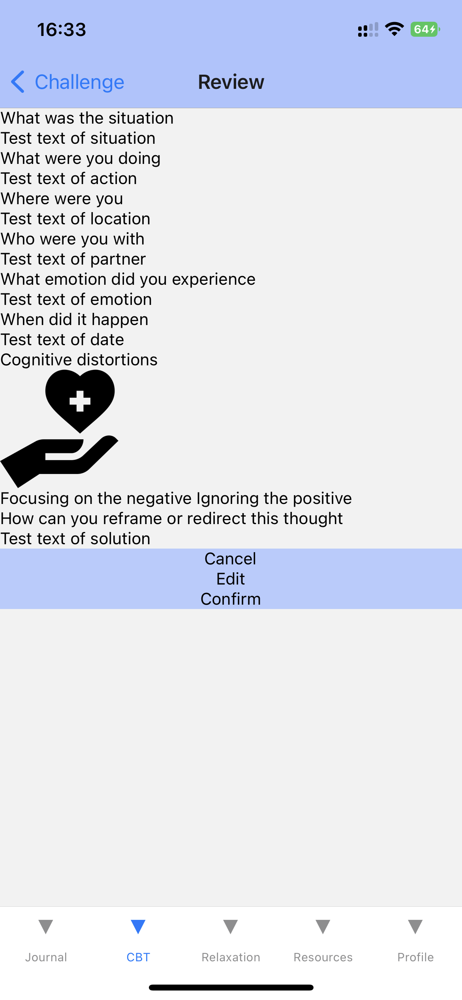

If users press cancel, they will get back to the browsing screen. If they press edit, they will get back to the first screen of describe situation(informations filled before will be kept). If they press confirm. The new entries will be added and they will get back to the browsing screen where the new entry has been added.

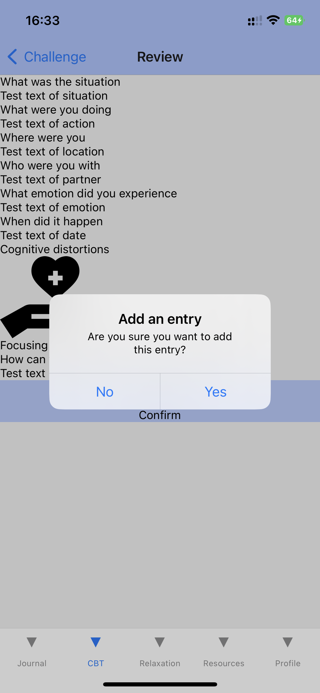 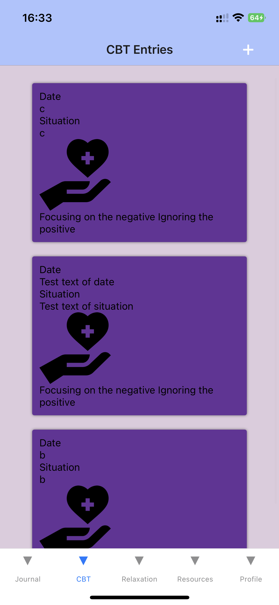

#### Edit an entry

In browsing screen, users could press the card and they will get to the details screen

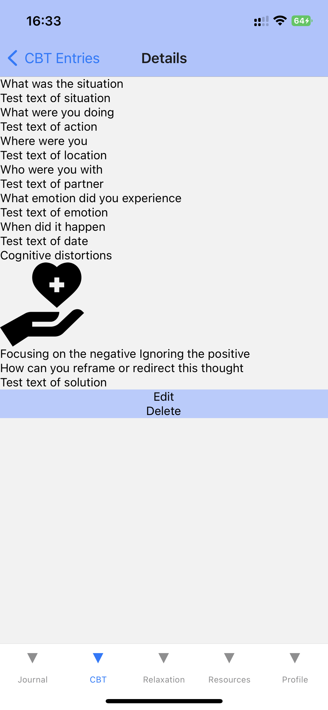

Users could press Edit button to edit this entry. After editing, they press confirm and get back to the browsing screen where the entry has been edited.

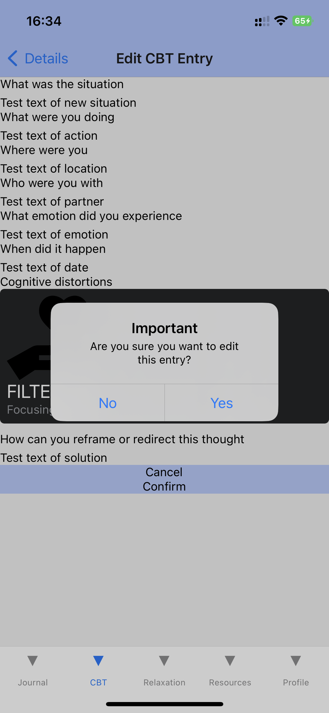 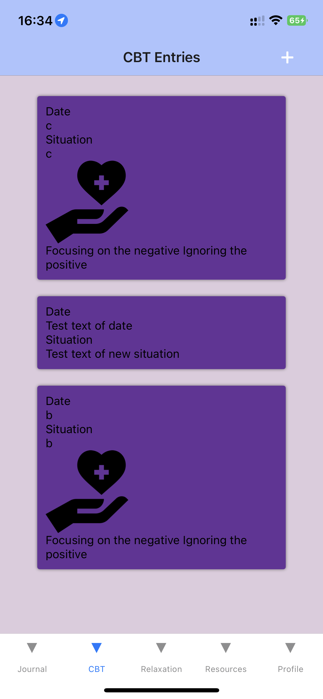

#### Delete an entry

In Details page users could also press the Delete button to delete the entry. After confirming delete they will get back to the browsing screen where the entry has been deleted.

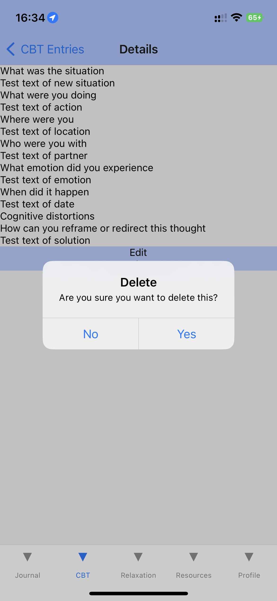 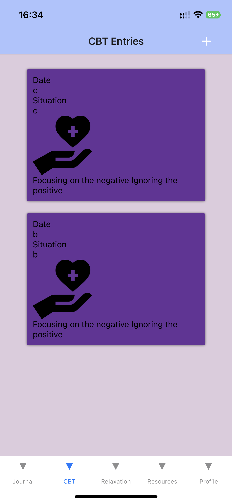

## Introduction

Group Members: Xilong Cai, Yiwei Tao, and Victor Wu

Welcome to our CBT Buddy app—the perfect tool for anyone looking to improve their mental health and well-being!
Our app offers a range of evidence-based techniques from Cognitive Behavioral Therapy (CBT) to help you manage stress, anxiety, and depression. With an intuitive interface and easy-to-follow exercises, our app is perfect for beginners and experienced users alike.

Our app includes the following features:

Mood tracking and Journaling: Keep track of your moods and emotions to identify patterns and triggers. Reflect on your thoughts and feelings and identify negative thinking patterns.
Thought challenging exercises: Learn how to challenge negative thoughts and beliefs with evidence-based techniques.
Relaxation techniques: Practice mindfulness, deep breathing, and other techniques to reduce stress and anxiety.
Therapy Resources: Using Vancouver city data, find therapy resources near you.

Our app works seamlessly across both iOS and Android devices and is designed with user privacy and security in mind, so users can use it with peace of mind. With our CBT Therapy app, you'll have all the tools you need to improve your mental health and well-being.
